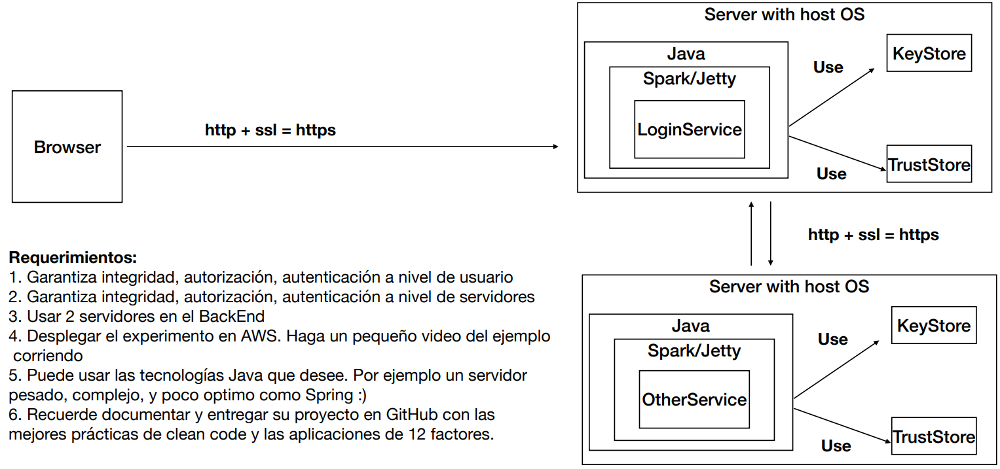

# AREP-Taller-7: APLICACIÓN DISTRIBUIDA SEGURA EN TODOS SUS FRENTES

Este repositorio contiene el código fuente y la documentación para un proyecto de desarrollo de una aplicación web segura. El objetivo principal de este proyecto es implementar una aplicación web que cumpla con rigurosos estándares de seguridad, garantizando la autenticación, autorización e integridad de los usuarios y los datos.

## Prerequisitos

Para que el código corra de forma satisfactoria y se puedan seguir todos los pasos se necesitara de: Java, Maven, Git y Docker; sin embargo,  para la descarga e instalación de estos elementos, adjunto los link de material de apoyo de otros autores

* [Tutorial instalación Java] (https://youtu.be/4WKo13f2Qpc?si=lHG84Jp_k7YbBFmp)
* [Tutorial instalación Git] (https://youtu.be/jpTrSSjPlEo?si=VdcaXSaNEFkR3hCk)
* [Tutorial instalación Maven] (https://youtu.be/biBOXvSNaXg?si=wfySIfBTUERGEVZC)
* [Tutorial instalación Docker] (https://youtu.be/_et7H0EQ8fY)

## Construido con:

* [Java](http://www.dropwizard.io/1.0.2/docs/) - Lenguaje con el cual funciona la mayor parte del proyecto
* [Html](https://developer.mozilla.org/es/docs/Web/HTML) - Usado para la sección del cliente
* [JavaScript](https://developer.mozilla.org/es/docs/Web/JavaScript) - Este lenguaje le permite al cliente realizar las peticiones necesarias
* [Maven](https://maven.apache.org/) - Usado para la construcción de la estructura del proyecto
* [Git](https://git-scm.com) - Usado para el versionamiento
* [Docker](https://www.docker.com/products/docker-desktop/) - Es un software que permite crear imágenes y correr contenedores
* [Spark](https://mvnrepository.com/artifact/org.apache.spark/spark-core) - Framework con el cual se realizó el API
* [AWS](https://aws.amazon.com/es/) - Plataforma de servicios en la nube que maneja almacenamiento, bases de datos, análisis, inteligencia artificial, aprendizaje automático, Internet de las cosas (IoT), seguridad y mucho más.

## Arquitectura

La arquitectura consiste en: 

* ### LoginService
Es un servidor que recibe peticiones HTTPS en el puerto 5000, además cuenta con un certificado el cual le brinda seguridad en las peticiones. El servidor recibe peticiones GET en la ruta /sing. Donde verifica con la ayuda de UserDataBase si los datos introducidos son correctos y en caso de que sean con ayuda de SecureURLReader se hace una comunicación segura con el servidor WebService.

* ### WebService
Es un servidor se encarga de mostrar una pagina web que contiene una imagen pero esta solo sera visible si el usuario logro hacer el login de manera satisfactoria, este servidor corre por el puerto 500 y tambien cuenta con un certficado para brindar comunicación de manera segura.

## Para Comenzar (Local)

### Repositorio

En primera instancia, debemos obtener el código del proyecto, por lo que se ejecutara el comando desde consola. (tenga en cuenta que debe estar en la carpeta deseada antes de clonar el repositorio)

~~~
https://github.com/JordyBautista10/AREP-Taller-7.git
~~~

Se entra a la carpeta del proyecto:

~~~
cd AREP-Taller-7
~~~

Posteriormente, descargamos las dependencias necesarias y compilamos el código:

~~~
mvn clean install compile
~~~

Ahora para ejecutar los servicios se usa el siguiente comando (es necesario contar con la sección <build> dentro del pom.xml):  

`Windows`
~~~
java -cp "target\classes;target\dependency\*" co.edu.escuelaing.WebService
~~~

`Linux`:
~~~
java -cp "target\classes:target\dependency\*" co.edu.escuelaing.WebService
~~~

## Pruebas (Local)

Una vez que se estén ejecutando todos los contenedores, dirígete al navegador de tu preferencia y coloca en el navegador la siguiente URL, e indica el archivo que deseas consultar, puede ser cualquiera que esté en la carpeta pública:

~~~
https://localhost:5000/index.html
~~~

Debería aparecer una página como la siguiente: 

#### Despliegue en AWS

* [Despliegue AWS](https://youtu.be/JVqdWfZmDjQ)

### Versioning

Para el versionamiento se usó [Git](https://git-scm.com). Si necesita volver en alguna versión del código, visite los commits.

### Autor

* **Jordy Santiago Bautista Sepulveda** 

